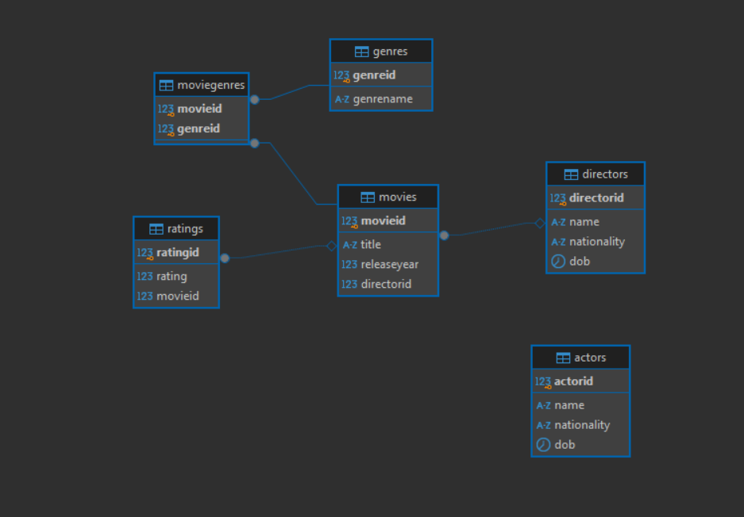

## Available Routes

### 1. **Actors Route**

- **Endpoint**: `/actors`
- **Description**: Handles all requests related to actors, such as fetching actor details, adding, updating, or deleting actors.

### 2. **Directors Route**

- **Endpoint**: `/directors`
- **Description**: Manages requests for directors, allowing operations like fetching, adding, updating, or deleting director information.

### 3. **Movies Route**

- **Endpoint**: `/movies`
- **Description**: Responsible for handling operations related to movies, such as retrieving movie information, adding new movies, updating existing ones, or deleting movies.

### 4. **Genres Route**

- **Endpoint**: `/genres`
- **Description**: Provides access to movie genres, enabling requests to fetch, add, update, or delete genres.

### 5. **Ratings Route**

- **Endpoint**: `/ratings`
- **Description**: Manages ratings for movies, allowing the creation, retrieval, updating, or deletion of movie ratings.

### 6. **Movie Genres Route**

- **Endpoint**: `/movieGenres`
- **Description**: Handles the association between movies and genres, updating or removal of genres for specific movies.

## Usage

To access these routes, send requests to the corresponding endpoints using the appropriate HTTP methods (GET, POST, PUT, DELETE) based on the functionality needed.
